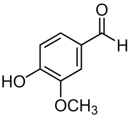

Modern JavaScript frameworks exist to address deficiencies in the capabilities provided out of the box by HTML5, JavaScript, CSS, and WebAssembly. The latest stable version of JavaScript ([ECMAScript&reg; 2015](https://ecma-international.org/ecma-262/6.0/)) evolved significantly compared to earlier versions, with better control over scope, powerful string manipulation capabilities, destructuring, parameter enhancements, and the built-in implementation of classes and modules (there is no longer a need to use IIFEs or immediately-invoked function expressions). The purpose of this post is to explore how to build modern apps using the latest JavaScript features.

## The Project

I implemented a Single Page Application (SPA) app based completely on pure JavaScript ("Vanilla.js"). It includes routing (you can bookmark and navigate pages), databinding, reusable web components and uses JavaScript's native module functionality. You can run and install the application (it is a Progressive Web App or PWA) here:

<i class="fas fa-external-link-alt"></i> [https://jlikme.z13.web.core.windows.net/vanillajs/](https://jlikme.z13.web.core.windows.net/vanillajs/?WT.mc_id=vanillajs-github-jeliknes)

The source code repository is available here:



If you open `index.html` you'll notice a script is included with a special type of "module":





The module simply imports and activates web components from several other modules.

## Organized Code with Modules

Native JavaScript modules are like ordinary JavaScript files with a few key differences. They should be loaded with the `type="module"` modifier. Some developers prefer to use the `.mjs` suffix to distinguish them from other JavaScript source, but that is not required. Modules are unique in a few ways:

* By default, they are parsed and executed in "strict mode"
* Modules can provide _exports_ to be consumed by other modules
* Modules can _import_ variables, functions, and objects from child modules
* Modules operate in their own scope and don't have to be wrapped in immediately invoked function expressions

There are four steps in the lifecycle of a module.

1. First, the module is parsed and validated
2. Second, the module is loaded
3. Third, related modules are linked based on their imports and exports
4. Finally, modules are executed

Any code not wrapped in a function is executed immediately in step 4.

This is what the parent level `app.js` module looks like:


import { registerDeck } from "./navigator.js"
import { registerControls } from "./controls.js"
import { registerKeyHandler } from "./keyhandler.js"

const app = async () => {
    registerDeck();
    registerControls();
    registerKeyHandler();
};

document.addEventListener("DOMContentLoaded", app);


Taking a step back, the overall structure or hierarchy of the application looks like this:


app.js 
-- navigator.js 
   -- slideLoader.js
      .. slide.js ⤵
   -- slide.js
      -- dataBinding.js
         -- observable.js
   -- router.js
   -- animator.js
-- controls.js
   .. navigator.js ⤴
-- keyhandler.js
   .. navigator.js ⤴


This post will explore the module from the bottom-up, starting with modules that don't have dependencies and working our way up to the `navigator.js` web component.

## Reacting to Changes with Observable

The `observable.js` module contains a simple implementation of the observer pattern. A class wraps a value and notifies subscribers when the value changes. A computed observable is available that can handle values derived from other observables (for example, the result of an equation where the variables are being observed). I covered this implementation in depth in a previous article:



## Support for Declarative Databinding

The `databinding.js` module provides databinding services to the application. The pair of methods `execute` and `executeInContext` are used to evaluate scripts with a designated `this`. Essentially, each "slide" has a context that is used for setting up expressions for databinding, and the scripts included in the slide are run in that context. The context is defined in the "slide" class that will be explored later.

> It's important to note this does not provide security: malicious scripts can still be executed; it only serves to provide a databinding scope. Building for production would require a much more involved process to parse out only "acceptable" expressions to avoid security exploits.

The `observable` and `computed` methods are simply helpers to create new instances of the related classes. They are used in the slides to set up databinding expressions. This is something easier "seen than said" so I'll provide an end-to-end example shortly.

The `bindValue` method sets up two-way databinding between an `HTMLInputElement` and an `Observable` instance. In this example, it uses the `onkeyup` event to signal whenever the input value changes. The converter helps handle the special case of binding to a `number` type.


bindValue(input, observable) {
   const initialValue = observable.value;
   input.value = initialValue;
   observable.subscribe(() => input.value = observable.value);
   let converter = value => value;
   if (typeof initialValue === "number") {
      converter = num => isNaN(num = parseFloat(num)) ? 0 : num;
   }
   input.onkeyup = () => {
      observable.value = converter(input.value);
   };
}


It is called from a `bindObservables` method that finds any elements with a `data-bind` attribute. Note again this code is simplified because it assumes the elements are input elements and does not do any validation.


bindObservables(elem, context) {
   const dataBinding = elem.querySelectorAll("[data-bind]");
   dataBinding.forEach(elem => {
      this.bindValue(elem, 
         context[elem.getAttribute("data-bind")]);
   });
}


The `bindLists` method is a little more complicated. It assumes it will iterate a (non-observable) list. First, any elements with a `repeat` attribute are found. The value is assumed to be a list reference and is iterated to produce a list of child elements. A regular expression is used to replace binding statements `{{item.x}}` with the actual value using `executeInContext`.

At this stage it makes sense to take a step back and see the bigger picture. You can run the data-binding example <i class="fas fa-external-link-alt"></i> [here](https://jlikme.z13.web.core.windows.net/vanillajs/#23).

In the HTML, the databinding for `n1` is declared like this:


<label for="first">
   
Number:

   <input type="text" id="first" data-bind="n1"/>
</label>


In the `script` tag it is set up like this:


const n1 = this.observable(2);
this.n1 = n1;


The context exists on the slide: `slide.ctx = {}` so when the script is evaluated, it becomes `slide.ctx = { n1: Observable(2) }`. The binding is then set up between the input field and the observable. In the case of the list, each list item is evaluated based on the databinding template to grab the corresponding value. What's missing here is the "context" that exists on the slide. Let's look at the `slide` and `sideLoader` modules next.

## Hosting and Loading Slides as "Pages"

The `Slide` class in `slide.js` is a simple class to hold the information that represents a "slide" in the app. It has a `_text` property that is read from the actual slide. For example, here is the raw text of [001-title.html](https://github.com/JeremyLikness/vanillajs-deck/blob/master/slides/001-title.html).


<title>Vanilla.js: Modern 1st Party JavaScript</title>
<h1>Vanilla.js: Modern 1st Party JavaScript</h1>

<h2>Jeremy Likness</h2>
<h3>Cloud Advocate, Microsoft</h3>
<next-slide>020-angular-project</next-slide>
<transition>slide-left</transition>


A `_context` is used to execute scripts (just an empty object passed as `this` to evaluations), a `_title` is parsed from the slide contents, and a `_dataBinding` property holds an instance of the databinding helper for the slide. If a transition is specified, the name of the transition is held in `_transition` and if there is a "next slide" the name is held in `_nextSlideName`.

The most important property is the `_html` property. This is a `div` element that wraps the content of the slide. The slide contents are assigned to the `innerHTML` property to create an active DOM node that can be easily swapped in and out as slides are navigated. This code in the constructor sets up the HTML DOM:


this._html = document.createElement('div');
this._html.innerHTML = text;


If there is a `<script>` tag in the slide, it is parsed in the context of the slide. The databinding helper is called to parse all attributes and render the associated lists and create two-way bindings between input elements and the observable data.


const script = this._html.querySelector("script");
if (script) {
   this._dataBinding.executeInContext(script.innerText, this._context, true);
   this._dataBinding.bindAll(this._html, this._context);
}


This sets up the slide in a "born ready" mode just waiting to appear. The `slideLoader.js` module is what loads the slides. It assumes they exist in a `slides` subdirectory with an `.html` suffix. This code reads the slide and creates a new instance of the `Slide` class.


async function loadSlide(slideName) {
    const response = await fetch(`./slides/${slideName}.html`);
    const slide = await response.text();
    return new Slide(slide);
}


The main function takes the first slide, then iterates all slides by reading the `nextSlide` property. To avoid getting caught in an infinite loop, a `cycle` object keeps track of slides that are already loaded and stops loading when there is a duplicate or no more slides to parse.


export async function loadSlides(start) {
    var next = start;
    const slides = [];
    const cycle = {};
    while (next) {
        if (!cycle[next]) {
            cycle[next] = true;
            const nextSlide = await loadSlide(next);
            slides.push(nextSlide);
            next = nextSlide.nextSlide;
        }
        else {
            break;
        }
    }
    return slides;
}


The loader is used by the `navigator.js` module that will be explored later.

## Handling Navigation with a Router

The `router.js` module is responsible for handling routing. It has two primary functions:

1. Setting the route (hash) to correspond to the current slide
2. Responding to navigation by raising a custom event to inform subscribers that the route has changed

The constructor uses a "phantom DOM node" (a `div` element that is never rendered) to set up a custom `routechanged` event.


this._eventSource = document.createElement("div");
this._routeChanged = new CustomEvent("routechanged", {
   bubbles: true,
   cancelable: false
});
this._route = null;


It then listens for browser navigation (the `popstate` event) and if the route (slide) has changed, it updates the route and raises the custom `routechanged` event.


window.addEventListener("popstate", () => {
   if (this.getRoute() !== this._route) {
         this._route = this.getRoute();
         this._eventSource.dispatchEvent(this._routeChanged);
   }
});


Other modules use the router to set the route when the slide is changed, or to show the correct slide when the route has changed (i.e. the user navigated to a bookmark or used the forward/backward buttons).

## Transition Timelines with CSS3 Animations

The `animator.js` module is used to handle transitions between slides. A transition is indicated by setting the `next-slide` element in the slide. By convention, two animations will exist for a transition: `anim-{transition}-begin` to animate the current slide, then `anim-{transition}-end` to animate the next slide. For a slide left, the current slide starts at a zero offset and is shifted left until it is "offscreen." Then, the new slide starts at an "offscreen" offset and is shifted left until it is fully on the screen. A special unit called `vw` for _view width_ is used to ensure the transitions work on any screen size.

The CSS for this set of animations looks like this:


@keyframes slide-left {
    from {
        margin-left: 0vw;
    }
    to {
        margin-left: -100vw;
    }
}

@keyframes enter-right {
    from {
        margin-left: 100vw;
    }
    to {
        margin-left: 0vw;
    }
}

.anim-slide-left-begin {
    animation-name: slide-left;
    animation-timing-function: ease-in;
    animation-duration: 0.5s;
}

.anim-slide-left-end {
    animation-name: enter-right;
    animation-timing-function: ease-out;
    animation-duration: 0.3s;
}


The module manages transitions by doing the following:

1. `beginAnimation` is invoked with the animation name and a callback.
2. The `_begin` and `_end` classes are set to keep track of them.
3. A flag is set to indicate a transition is in process. This prevents additional navigation during an existing transition event.
4. An event listener is attached to the HTML element that will fire when the associated animation ends.
5. The animation "begin" class is added to the element. This fires the animation.
6. When the animation ends, the event listener is removed, transition flag is turned off, and the "begin" class is removed from the element. The callback is fired.


beginAnimation(animationName, host, callback) {
   this._transitioning = true;
   this._begin = `anim-${animationName}-begin`;
   this._end = `anim-${animationName}-end`;
   const animationEnd = () => {
      host.removeEventListener("animationend", animationEnd);
      host.classList.remove(this._begin);
      this._transitioning = false;
      callback();
   }
   host.addEventListener("animationend", animationEnd, false);
   host.classList.add(this._begin);
}


The callback will inform the host the transition is complete. In this case, `navigator.js` will pass a callback. The callback advances the slide, then calls `endAnimation`. The code is like the start animation, with the exception it resets all properties when complete.


endAnimation(host) {
   this._transitioning = true;
   const animationEnd = () => {
      host.removeEventListener("animationend", animationEnd);
      host.classList.remove(this._end);
      this._transitioning = false;
      this._begin = null;
      this._end = null;
   }
   host.addEventListener("animationend", animationEnd, false);
   host.classList.add(this._end);
}


The steps will be clearer when you see how the code is handled by the navigator module that is covered next.

## A Navigator to Manage the "Deck"

The `navigator.js` is the "main module" that controls the deck. It is responsible for showing slides and handling movement between slides. This is the first module we will examine to expose itself as a reusable [web component](https://developer.mozilla.org/docs/Web/Web_Components). Because it is a web component, the class definition extends `HTMLElement`:


export class Navigator extends HTMLElement { }


The module exposes a `registerDeck` function to register the web component. I chose to create a new HTML element `<slide-deck/>` so it is registered like this:


export const registerDeck = () => 
    customElements.define('slide-deck', Navigator);


The constructor calls the parent constructor which is built into the browser to initialize HTML elements. It then creates instances of the router and animator and gets the current route. It exposes a custom `slideschanged` event, then listens to the router's `routetchanged` event and advances to the appropriate slide when it is fired.


super();
this._animator = new Animator();
this._router = new Router();
this._route = this._router.getRoute();
this.slidesChangedEvent = new CustomEvent("slideschanged", {
   bubbles: true,
   cancelable: false
});
this._router.eventSource.addEventListener("routechanged", () => {
   if (this._route !== this._router.getRoute()) {
         this._route = this._router.getRoute();
         if (this._route) {
            const slide = parseInt(this._route) - 1;
            this.jumpTo(slide);
         }
   }
});


To load the slides, a custom `start` attribute is defined. The main `index.html` sets up the web component like this:


<slide-deck id="main" start="001-title">
   <h1>DevNexus | Vanilla.js: Modern 1st Party JavaScript</h1>
   <h2>Setting things up ...</h2>
</slide-deck>


Note the element has `innerHTML` like any other `HTMLElement`, so the HTML is rendered until it is replaced. To parse the attribute requires two steps. First, the attribute must be observed. By convention, this is done with a static property `observedAttributes`:


static get observedAttributes() {
   return ["start"];
}


Next, a callback is implemented that is called whenever the attributes change (including the first time they are parsed and set). This callback is used to get the `start` attribute value and load the slides, then show the appropriate slide based on whether it was invoked with a route.


async attributeChangedCallback(attrName, oldVal, newVal) {
   if (attrName === "start") {
      if (oldVal !== newVal) {
            this._slides = await loadSlides(newVal);
            this._route = this._router.getRoute();
            var slide = 0;
            if (this._route) {
               slide = parseInt(this._route) - 1;
            }
            this.jumpTo(slide);
            this._title = document.querySelectorAll("title")[0];
      }
   }
}


The remaining properties and methods deal with the current slide, total slide count, and navigation. For example, `hasPrevious` will return `true` for everything but the first slide. `hasNext` is a bit more involved. For things like revealing cards or lists one item at a time, a class named `appear` can be applied. It hides the element but when the slides are "advanced" and an element exists with that class, it is removed. This results in that element appearing. The check looks to see if the class exists on any elements first, then checks to see if the index is on the last slide.


get hasNext() {
   const host = this.querySelector("div");
   if (host) {
      const appear = host.querySelectorAll(".appear");
      if (appear && appear.length) {
            return true;
      }
   }
   return this._currentIndex < (this.totalSlides - 1);
}


The `jumpTo` method navigates to a new slide. It ignores the request if a transition is taking place. Otherwise, it clears the contents of the parent container and attaches the new slide. It updates the page title and raises the `slideschanged` event. If the jump occurs at the end of a transition, it kicks off the ending animation.


jumpTo(slideIdx) {
   if (this._animator.transitioning) {
      return;
   }
   if (slideIdx >= 0 && slideIdx < this.totalSlides) {
      this._currentIndex = slideIdx;
      this.innerHTML = '';
      this.appendChild(this.currentSlide.html);
      this._router.setRoute((slideIdx + 1).toString());
      this._route = this._router.getRoute();
      document.title = `${this.currentIndex + 1}/${this.totalSlides}: ${this.currentSlide.title}`;
      this.dispatchEvent(this.slidesChangedEvent);
      if (this._animator.animationReady) {
            this._animator.endAnimation(this.querySelector("div"));
      }
   }
}


The `next` function is responsible for the ordinary flow from one slide to the next. If there is an element with the `appear` class, it will simply remove the class to make it appear. Otherwise, it checks to see if there is a subsequent slide. If the slide has an animation, it kicks off the begin animation with a callback to jump to the next slide when the animation is complete (the jump will run the end animation). If there is no transition, it jumps directly to the slide.


next() {
   if (this.checkForAppears()) {
      this.dispatchEvent(this.slidesChangedEvent);
      return;
   }
   if (this.hasNext) {
      if (this.currentSlide.transition !== null) {
            this._animator.beginAnimation(
               this.currentSlide.transition,
               this.querySelector("div"),
               () => this.jumpTo(this.currentIndex + 1));
      }
      else {
            this.jumpTo(this.currentIndex + 1);
      }
   }
}


This web component hosts the slide deck. There are two more components that work with it to control the slides: a key press handler for keyboard navigation, and a set of controls that can be clicked or tapped.

## Keyboard Support

The `keyhandler.js` module is another web component defined as `<key-handler/>`.


export const registerKeyHandler = 
    () => customElements.define('key-handler', KeyHandler);


Here it is in the main page:


<key-handler deck="main"></key-handler>


It has one attribute named `deck` that points to the `id` of a `navigator.js` instance. When it is set, it saves a reference to the deck. It then listens for right arrow (code 39) or the space bar (code 32) to advance the deck, or the left arrow (code 37) to move to the previous slide.


async attributeChangedCallback(attrName, oldVal, newVal) {
   if (attrName === "deck") {
      if (oldVal !== newVal) {
            this._deck = document.getElementById(newVal);
            this._deck.parentElement.addEventListener("keydown", key => {
               if (key.keyCode == 39 || key.keyCode == 32) {
                  this._deck.next();
               }
               else if (key.keyCode == 37) {
                  this._deck.previous();
               }
            });
      }
   }
}


> The code is purposefully simplified. It assumes the `id` is set correctly and doesn't check to see if the element is found and is an instance of a `<slide-deck/>`. It may also trigger from inside an input box which is not an ideal user experience.

## Controls to Click and Tap

The last module, also a web component, is the controls for the deck. This is registered as `<slide-controls/>`.


export const registerControls = 
    () => customElements.define('slide-controls', Controls);


Here is the main page declaration:


<slide-controls deck="main" class="footer center">
---
</slide-controls>


By plugging into the web component lifecycle method `connectedCallback`, the module will dynamically load the template for the controls and wire in event listeners after the parent element is inserted into the DOM.


async connectedCallback() {
   const response = await fetch("./templates/controls.html");
   const template = await response.text();
   this.innerHTML = "";
   const host = document.createElement("div");
   host.innerHTML = template;
   this.appendChild(host);
   this._controlRef = {
      first: document.getElementById("ctrlFirst"),
      prev: document.getElementById("ctrlPrevious"),
      next: document.getElementById("ctrlNext"),
      last: document.getElementById("ctrlLast"),
      pos: document.getElementById("position")
   };
   this._controlRef.first.addEventListener("click", 
       () => this._deck.jumpTo(0));
   this._controlRef.prev.addEventListener("click", 
       () => this._deck.previous());
   this._controlRef.next.addEventListener("click", 
       () => this._deck.next());
   this._controlRef.last.addEventListener("click", 
       () => this._deck.jumpTo(this._deck.totalSlides - 1));
   this.refreshState();
}


Notice the buttons simply call the existing methods exposed by the `navigator.js` module. The module is referenced when the `deck` attribute is set. The code saves the reference and listens to the `slideschanged` event.


async attributeChangedCallback(attrName, oldVal, newVal) {
   if (attrName === "deck") {
      if (oldVal !== newVal) {
            this._deck = document.getElementById(newVal);
            this._deck.addEventListener("slideschanged", 
                () => this.refreshState());
      }
   }
}


Finally, `refreshState` is called upon initialization and whenever the slides change. It determines which buttons to enable or disable based on what slide is being shown and updates the _x of y_ text as well.


refreshState() {
   if (this._controlRef == null) {
      return;
   }
   const next = this._deck.hasNext;
   const prev = this._deck.hasPrevious;
   this._controlRef.first.disabled = !prev;
   this._controlRef.prev.disabled = !prev;
   this._controlRef.next.disabled = !next;
   this._controlRef.last.disabled = 
       this._deck.currentIndex === (this._deck.totalSlides - 1);
   this._controlRef.pos.innerText = 
       `${this._deck.currentIndex + 1} / ${this._deck.totalSlides}`;
}


Because the control is a web component, a second instance could easily be placed at the top of the page to provide more options for navigation if so desired.

## Conclusion

The intent of this project is to show what is possible with purely modern JavaScript. Frameworks still have their place, but it is important to understand what's possible with native capabilities to write code that is portable and maintainable (for example, a class is a class in any framework). Mastering JavaScript can make it easier for you to troubleshoot issues and provide better comprehension of features (for example, seeing how to implement databinding may improve your understanding of how to use it in a framework).

What do you think? Share your thoughts and comments below.

Regards,

